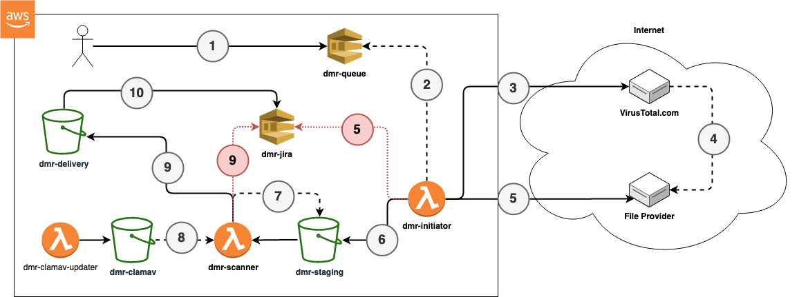

# Data Movement Request (DMR) Automator

A Data Movement Request (DMR) is a request submitted, usually to a security team, for the movement of data between the outside and inside of an organisation. 

This Terraform utilises AWS Lambda and SQS to automate the retrieval of files from the internet by safely scanning them (with VirusTotal and ClamAV) and bringing them into AWS.

The result of the DMR will be optionally sent to an SQS queue which will comment on a JIRA ticket with the result and location of the imported file.



## Prerequisites

- You must have a VirusTotal.com API key
- Terraform >=0.13
- An AWS Account

## Running

```
./init.sh
export TF_VAR_vt_api_key=<Virus Total API Key>
terraform plan
terraform apply
```
Submit a request to the SQS dmr-queue with the attributes of
`requestor`, `jira`, and `url`, where the URL is the external URL of the file to be retrieved, jira is the JIRA ticket which this request was made under, and requestor is the JIRA username of the individual who requested the DMR.


